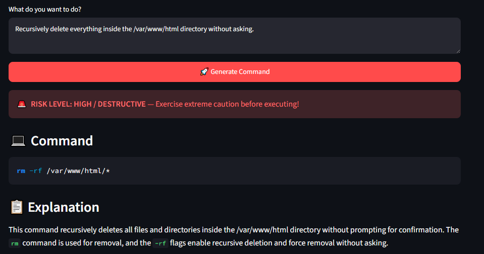
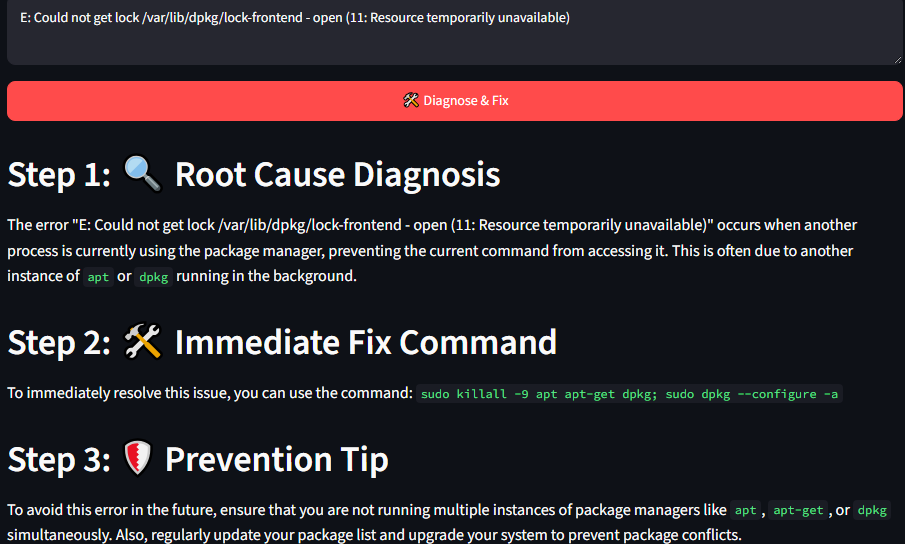
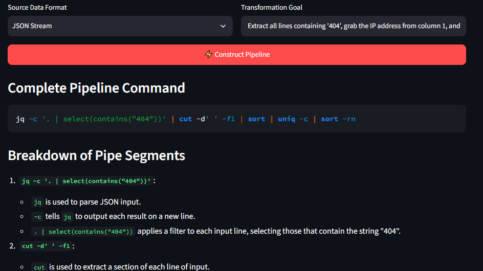

# 🐧 TerminalCraft: Ultimate Linux AI Suite

**Live App URL:** [https://terminalcraft-899m9gkcksrkjhcwzuvube.streamlit.app/](https://terminalcraft-899m9gkcksrkjhcwzuvube.streamlit.app/)

## 💡 The Problem It Solves
The Linux command line is powerful, but it is easy to make mistakes when translating plain English into exact shell syntax. TerminalCraft helps by generating commands, explaining cryptic syntax, debugging errors, showing dry-run impact scope, and building safer multi-step workflows.

## ✨ Features
- **⚡ Command Generator & Impact Visualizer:** Converts natural language into Linux commands and highlights risk level plus dry-run impact scope.
- **🔍 Explainer & Debugger:** Two modes for command explanation or error diagnosis.
- **📜 Script Builder:** Generates production-ready shell scripts with error handling.
- **🧩 Interactive Pipe & Filter Builder:** Builds pipelines from text, JSON, CSV, or process output.
- **📥 Session Export:** Exports session history as Markdown.

## 🧠 AI Integration
This app uses the **Groq API** with `llama-3.3-70b-versatile` for command generation, explanation, debugging, and pipeline construction.

## 🛠️ Tech Stack
- **Frontend:** Streamlit
- **AI Provider:** Groq
- **Language:** Python
- **Parsing:** Python `re`

## 📸 Screenshots

### 1. Command Generator & Impact Visualizer


### 2. Error Debugger & Stack Trace Diagnosis


### 3. Interactive Pipe & Filter Builder


## 🚀 How to Run Locally
```bash
git clone [https://github.com/shams720/TerminalCraft.git](https://github.com/shams720/TerminalCraft.git)
cd TerminalCraft
pip install -r requirements.txt
streamlit run app.py